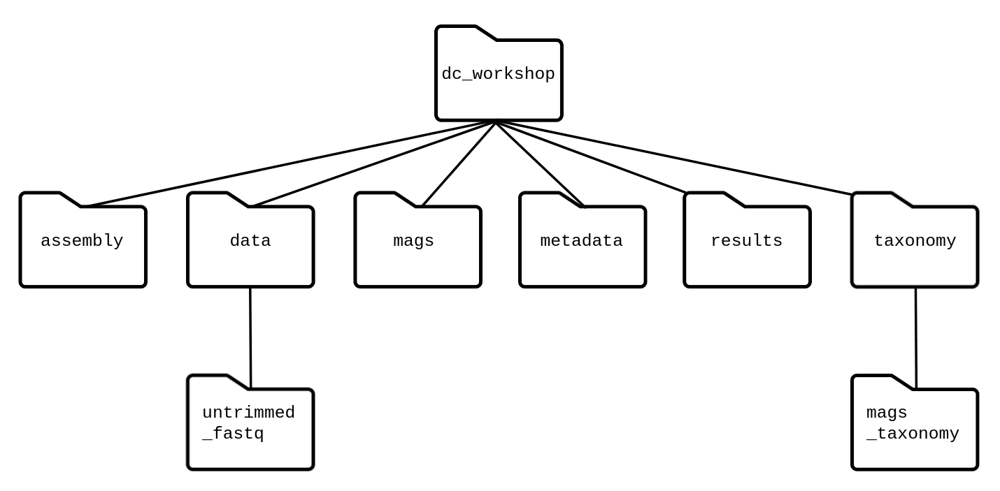

## What is a shell and why should I care?

A *shell* is a computer program that presents a command line interface
which allows you to control your computer using commands entered
with a keyboard instead of controlling graphical user interfaces
(GUIs) with a mouse/keyboard combination.

There are many reasons to learn about the shell.

* Many bioinformatics tools can only be used through a command line interface, or 
have extra capabilities in the command line version that are not available in the GUI.
This is true, for example, of BLAST, which offers many advanced functions only accessible
to users who know how to use a shell.  
* The shell makes your work less boring. In bioinformatics you often need to do
the same set of tasks with a large number of files. Learning the shell will allow you to
automate those repetitive tasks and leave you free to do more exciting things.  
* The shell makes your work less error-prone. When humans do the same thing a hundred different times
(or even ten times), they're likely to make a mistake. Your computer can do the same thing a thousand times
with no mistakes.  
* The shell makes your work more reproducible. When you carry out your work in the command-line 
(rather than a GUI), your computer keeps a record of every step that you've carried out, which you can use 
to re-do your work when you need to. It also gives you a way to communicate unambiguously what you've done, 
so that others can check your work or apply your process to new data.  
* Many bioinformatic tasks require large amounts of computing power and can't realistically be run on your
own machine. These tasks are best performed using remote computers or cloud computing, which can only be accessed
through a shell.

In this lesson you will learn how to use the command line interface to move around in your file system. 

## How to access the shell

On a Mac or Linux machine, you can access a shell through a program called Terminal, which is already available
on your computer. If you're using Windows, you'll need to download a separate program to access the shell (see installation instructions [here](https://carpentries-incubator.github.io/metagenomics//setup.html)).

In this workshop, we suggest using a remote server to invest most of our time learning the basics of shell by manipulating some experimental data. The remote server already includes the required bioinformatics packages as well as the large datasets that usually take a lot of time to load into everyone's local computers.

Ask your instructor for the `ip_address` and password to login.

After logging in, you will see a screen showing something like this: 

~~~
Welcome to Ubuntu 14.04.3 LTS (GNU/Linux 3.13.0-48-generic x86_64)

 * Documentation:  https://help.ubuntu.com/

  System information as of Sat Feb  2 00:08:17 UTC 2019

  System load: 0.0                Memory usage: 5%   Processes:       82
  Usage of /:  29.9% of 98.30GB   Swap usage:   0%   Users logged in: 0

  Graph this data and manage this system at:
    https://landscape.canonical.com/

  Get cloud support with Ubuntu Advantage Cloud Guest:
    http://www.ubuntu.com/business/services/cloud

597 packages can be updated.
444 updates are security updates.

New release '16.04.5 LTS' available.
Run 'do-release-upgrade' to upgrade to it.

Last login: Fri Feb  1 22:34:53 2019 from c-73-116-43-163.hsd1.ca.comcast.net
~~~
{: .output}

This provides a lot of information about the remote server that you're logging in to. We're not going to use most of this information for
our workshop, so you can clear your screen using the `clear` command. 

~~~
$ clear
~~~
{: .bash}

This will scroll your screen down to give you a fresh screen and will make it easier to read. 
You haven't lost any of the information on your screen. If you scroll up, you can see everything that has been output to your screen
up until this point.

## Navigating your file system

The part of the operating system responsible for managing files and directories
is called the **file system**.
It organizes our data into files,
which hold information,
and directories (also called "folders"),
which hold files or other directories.

Several commands are frequently used to create, inspect, rename, and delete files and directories.

> ## Preparation Magic
>
> If you type the command:
> `PS1='$ '`
> into your shell, followed by pressing the <kbd>Enter</kbd> key,
> your window should look like our example in this lesson.  
> This isn't necessary to follow along (in fact, your prompt may have
> other helpful information you want to know about).  This is up to you!  
{: .callout}

~~~
$
~~~
{: .bash}

The dollar sign is a **prompt**, which shows us that the shell is waiting for input;
your shell may use a different character as a prompt and may add information before
the prompt. When typing commands, either from these lessons or from other sources,
do not type the prompt, only the commands that follow it.

Let's find out where we are by running a command called `pwd`
(which stands for "print working directory").
At any moment, our **current working directory**
is our current default directory,
i.e.,
the directory that the computer assumes we want to run commands in
unless we explicitly specify something else.
Here,
the computer's response is `/home/dcuser`,
which is the top level directory within our cloud system:

~~~
$ pwd
~~~
{: .bash}

~~~
/home/dcuser
~~~
{: .output}

Let's look at how our file system is organized. We can see what files and subdirectories are in this directory by running `ls`,
which stands for "listing":

~~~
$ ls
~~~
{: .bash}

~~~
dc_workshop  R  r_data shell_data 
~~~
{: .output}

`ls` prints the names of the files and directories in the current directory in
alphabetical order,arranged neatly into columns. 
We'll be working within the `dc_workshop` subdirectory, and creating new subdirectories, 
throughout this workshop.  

The command to change locations in our file system is `cd` followed by a
directory name to change our working directory.
`cd` stands for "change directory".

Let's say we want to navigate to the `dc_workshop` directory we saw above.  We can
use the following command to get there:

~~~
$ cd dc_workshop
~~~
{: .bash}

Let's look at what is in this directory:

~~~
$ ls
~~~
{: .bash}

~~~
assembly  data	mags  metadata	results  taxonomy
~~~
{: .output}

We can make the `ls` output more comprehensible by using the **flag** `-F`,
which tells `ls` to add a trailing `/` to the names of directories:

~~~
$ ls -F
~~~
{: .bash}

~~~
assembly/  data/  mags/  metadata/  results/  taxonomy/
~~~
{: .output}

Anything with a "/" after it is a directory. Things with a "*" after them are programs. If
there are no decorations, it's a file.

To understand a little better how to move between folders, let's see the following image:

Here we can see a diagram of how the folders are arranged one inside another. In this way, if we think about moving,
from dc_workshop to the untrimmed_fastq folder, the path must go as they are ordered: 
~~~
cd dc_workshop/data/untrimmed_fastq
~~~
{: .bash}

`ls` has lots of other options. To find out what they are, we can type:

~~~
$ man ls
~~~
{: .bash}

Some manual files are very long. You can scroll through the file using
your keyboard's down arrow or use the <kbd>Space</kbd> key to go forward one page
and the <kbd>b</kbd> key to go backwards one page. When you are done reading, hit <kbd>q</kbd>
to quit.

> ## Excercise 1: Extra information with `ls -l`
> Use the `-l` option for the `ls` command to display more information for each item 
> in the directory. What is one piece of additional information this long format
> gives you that you don't see with the bare `ls` command?
>
> > ## Solution
> > ~~~
> > $ ls -l
> > ~~~
> > {: .bash}
> > 
> > ~~~
> > total 28
> > drwxr-xr-x  2 dcuser dcuser 4096 Mar  3 20:21 16s
> > drwxr-xr-x  2 dcuser dcuser 4096 Nov 26 12:33 assembly
> > drwxrwxr-x 10 dcuser dcuser 4096 Mar 10 21:03 assembly_JC1A
> > drwxr-xr-x  2 dcuser dcuser 4096 Mar 10 21:11 data
> > drwxr-xr-x  2 dcuser dcuser 4096 Nov 26 12:51 metadata
> > drwxr-xr-x  2 dcuser dcuser 4096 Nov 26 12:51 report
> > drwxr-xr-x  2 dcuser dcuser 4096 Mar  7 19:56 taxonom
> > ~~~
> > {: .output}
> > 
> > The additional information given includes the name of the owner of the file,
> > when the file was last modified, and whether the current user has permission
> > to read and write to the file.
> > 
> {: .solution}
{: .challenge}

No one can possibly learn all of these arguments, that's why the manual page
is for. You can (and should) refer to the manual page or other help files
as needed.

Let's go into the `data` directory and see what is in there.

~~~
$ cd data/untrimmed_fastq
$ ls -F
~~~
{: .bash}

~~~
JC1A_R1.fastq.gz  JC1A_R2.fastq.gz  JP4D_R1.fastq.gz  JP4D_R2.fastq.gz
~~~
{: .output}

This directory contains four files with `.fastq.gz` extensions. FASTQ is a format
for storing information about sequencing reads and their quality. GZ is an archive file compressed.
We will be learning more about FASTQ files in a later lesson. These data comes in a compressed format, 
which is why there is a `.gz` at the end of the files. 
This makes it faster to transfer, and allows it to take up less space on our computer. 
Let's use `gunzip` to decompress the files so that we can look at the FASTQ format.
~~~
$ gunzip JC1A_R1.fastq.gz  JC1A_R2.fastq.gz  JP4D_R1.fastq.gz  JP4D_R2.fastq.gz
$ ls
~~~
{: .bash}

~~~
JC1A_R1.fastq  JC1A_R2.fastq  JP4D_R1.fastq  JP4D_R2.fastq
~~~
{: .output}

### Shortcut: Tab Completion

Usually the key Tab is located on the left side of the keyboard just above the "Shift" key or "Mayus" key. 

Typing out file or directory names can waste a
lot of time and it's easy to make typing mistakes. Instead we can use tab complete 
as a shortcut. When you start typing out the name of a directory or file, then
hit the <kbd>Tab</kbd> key, the shell will try to fill in the rest of the
directory or file name.

Return to your home directory:

~~~
$ cd
~~~
{: .bash}

then enter:

~~~
$ cd dc<tab>
~~~
{: .bash}

The shell will fill in the rest of the directory name for
`dc_workshop`.

Now change directories to `data` in `dc_workshop`

~~~
$ cd dc_workshop
$ cd data
~~~
{: .bash}

Using tab complete can be very helpful. However, it will only autocomplete
a file or directory name if you've typed enough characters to provide
a unique identifier for the file or directory you are trying to access.

If we navigate back to our `data` directory and try to access one of our sample files:

~~~
$ cd
$ cd dc_workshop
$ cd data/untrimmed_fastq
$ ls JC<tab>
~~~
{: .bash}

The shell auto-completes your command to `JC1A_R`, because there is another file name in 
the directory begin with this prefix. When you hit
<kbd>Tab</kbd> again, the shell will list the possible choices.

~~~
$ ls JC1A_R<tab><tab>
~~~
{: .bash}

~~~
JC1A_R1.fastq  JC1A_R2.fastq
~~~
{: .output}

Tab completion can also fill in the names of programs, which can be useful if you
remember the beginning of a program name.

~~~
$ pw<tab><tab>
~~~
{: .bash}

~~~
pwd   pwdx
~~~
{: .output}

Displays the name of every program that starts with `pw`. 

## Summary

We now know how to move around our file system using the command line.
This gives us an advantage over interacting with the file system through
a Graphical User Interface (GUI) as it allows us to work on a remote server, carry out the same set of operations 
on a large number of files quickly, and opens up many opportunities for using 
bioinformatics software that is only available in command line versions. 

In the next few episodes, we'll be expanding on these skills and seeing how 
using the command line shell enables us to make our workflow more efficient and reproducible.
